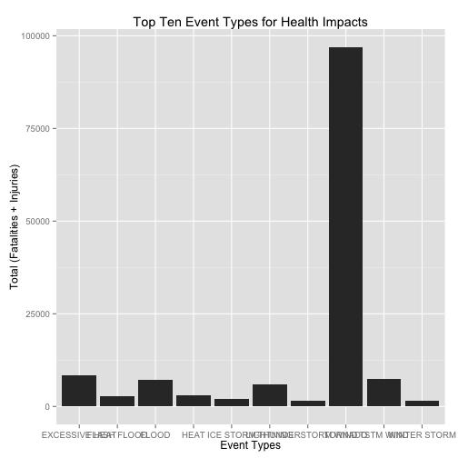
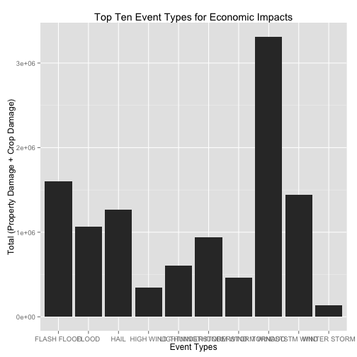

NOAA Storm Database Exploration
======================================
Reproducible Research Peer Assessment 2
----------------------------------------
### Synopsis
This analysis started with two questions:

1. What type of events are the most harmful with respect to population health?
2. What type of events have the greatest economic impact?

In both cases, "TORNADO" was the clear leader in population health and economic impact. 

To access or learn about this data go to [Storm Data Documentation](https://d396qusza40orc.cloudfront.net/repdata%2Fpeer2_doc%2Fpd01016005curr.pdf).

### Data Processing
The overall approach here was to filter the data down to the fields needed and then apply calculations across Event Types for health impact and economic damage. 

The first step was to read in the data:

```r
## Read the data into R and subset it to the needed columns only assumes the
## data is in the working directory wiht original file name
tempdata <- read.csv("repdata-data-StormData.csv.bz2")
data <- tempdata[, c("STATE", "EVTYPE", "FATALITIES", "INJURIES", "PROPDMG", 
    "CROPDMG")]
rm(tempdata)
```


The next step was to create a dataset for health:

```r
## Create a dataframe for injuries and fatalities by Event Type and order the
## results. Uses a for loop through each EVTYPE and populates a new data
## frame called 'health'
health <- data.frame()
Event <- levels(data$EVTYPE)
for (i in Event) {
    injury <- sum(data$INJURIES[data$EVTYPE == i])
    fatality <- sum(data$FATALITIES[data$EVTYPE == i])
    total <- injury + fatality
    nrow <- c(injury, fatality, total)
    health <- rbind.data.frame(health, nrow)
}
names(health) <- c("Injuries", "Fatalities", "Total")
health <- cbind.data.frame(Event, health)
## Order health by Total impact
health <- health[order(-health$Total), ]
```


Followed up by a dataset for economic impact:

```r
## Create a dataframe for property damage and crop damage by Event Type and
## order the results. Uses a for loop through each EVTYPE and populates a new
## data frame called 'health'
econ <- data.frame()
Event <- levels(data$EVTYPE)
for (i in Event) {
    propimpact <- sum(data$PROPDMG[data$EVTYPE == i])
    cropimpact <- sum(data$CROPDMG[data$EVTYPE == i])
    totalimpact <- propimpact + cropimpact
    nrow <- c(propimpact, cropimpact, totalimpact)
    econ <- rbind.data.frame(econ, nrow)
}
names(econ) <- c("PropDmg", "CropDmg", "TotalDmg")
econ <- cbind.data.frame(Event, econ)
# Order econ by Total Damage
econ <- econ[order(-econ$TotalDmg), ]
```


This concludes the data processing requirements for the analysis.

### Results
After running the processing we can plot and display our results. 

First we will look at the health impact:

```r
## Plot the top 10 results for health impact as a graph and data
tophealth <- health[1:10, ]
qplot(Event, Total, data = tophealth, geom = "bar", stat = "identity", main = "Top Ten Event Types for Health Impacts", 
    xlab = "Event Types", ylab = "Total (Fatalities + Injuries)")
```

 

```r
tophealth
```

```
##                 Event Injuries Fatalities Total
## 834           TORNADO    91346       5633 96979
## 130    EXCESSIVE HEAT     6525       1903  8428
## 856         TSTM WIND     6957        504  7461
## 170             FLOOD     6789        470  7259
## 464         LIGHTNING     5230        816  6046
## 275              HEAT     2100        937  3037
## 153       FLASH FLOOD     1777        978  2755
## 427         ICE STORM     1975         89  2064
## 760 THUNDERSTORM WIND     1488        133  1621
## 972      WINTER STORM     1321        206  1527
```

We can see from the table and the plot that "TORNADO" is the clear leader in health impacts.

Next we will look at the economic impact:

```r
## Plot the top 10 results for economic impact as a graph and data
topecon <- econ[1:10, ]
qplot(Event, TotalDmg, data = topecon, geom = "bar", stat = "identity", main = "Top Ten Event Types for Economic Impacts", 
    xlab = "Event Types", ylab = "Total (Property Damage + Crop Damage)")
```

 

```r
topecon
```

```
##                  Event PropDmg CropDmg TotalDmg
## 834            TORNADO 3212258  100019  3312277
## 153        FLASH FLOOD 1420125  179200  1599325
## 856          TSTM WIND 1335966  109203  1445168
## 244               HAIL  688693  579596  1268290
## 170              FLOOD  899938  168038  1067976
## 760  THUNDERSTORM WIND  876844   66791   943636
## 464          LIGHTNING  603352    3581   606932
## 786 THUNDERSTORM WINDS  446293   18685   464978
## 359          HIGH WIND  324732   17283   342015
## 972       WINTER STORM  132721    1979   134700
```

Again, "TORNADO" is the leading contributor to economic impact across all severe weather events.

### Conclusion
Additional analysis to narrow down the types of events for specific geographic regions could be helpful in making perparedness or response efforts more effective. These results represent a national view of the data without taking into account how some states do not share in the impact of tornadoes. 
